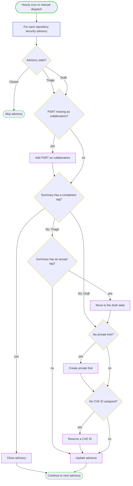

# PSRT GHSA Bot

PSRT GHSA Bot is a GitHub App that automates the [Python Security Response Team
(PSRT)](https://devguide.python.org/security/psrt/)'s
handling of GitHub Security Advisories. It runs hourly (or by manual dispatch)
and, for every advisory it closes ones marked as completed, promotes accepted ones
from triage to draft, reserves CVE IDs, creates private forks, and adds the
PSRT team as collaborators.

It only processes installations owned by the account named in the `GH_REQUIRED_ORG`
environment variable; installations under any other user are skipped.
For that account it processes every repository the GitHub App is installed on.
The process is identical across repositories except that CVE IDs are only
reserved for repositories listed in the `CVE_ENABLED_REPOS` environment variable.

